<div align="center">
	<br>
	<br>
	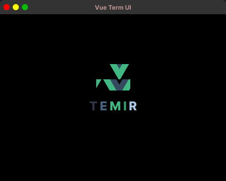
	<br>
	<br>
	<br>
</div>


<p align='center'>
English | <a href='./README.zh-CN.md'>简体中文</a>
</p>

> Vue for CLIs. Build your CLI output using components.

Temir provides the same component-based UI building experience that Vue offers in the browser, but for command-line apps.

It uses [Yoga](https://github.com/facebook/yoga) to build Flexbox layouts in the terminal, so most CSS-like props are available in Temir as well.
If you are already familiar with Vue, you already know Temir.

Since Temir is a Vue renderer, it means that most of the features of Vue are supported.
Head over to [Vue](https://vuejs.org/) website for documentation on how to use it.
Only Temir's methods will be documented in this readme.

---

## Install

```sh
npm install @temir/core
```

## Usage

```vue
<script lang="ts" setup>
import { ref } from '@vue/runtime-core'
import { TBox, TText } from '@temir/core'
const counter = ref(0)
setInterval(() => {
  counter.value++
}, 100)
</script>

<template>
  <TBox>
    <TText color="green">
      {{ counter }} tests passed
    </TText>
  </TBox>
</template>

```

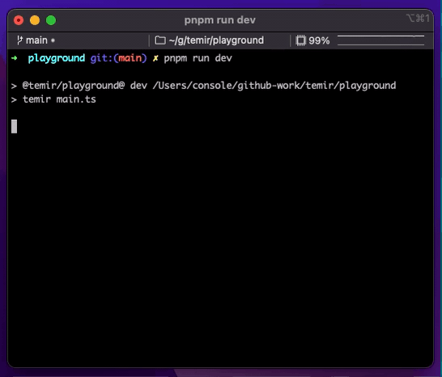

## HMR Support


## Contents

- [Getting Started](#getting-started)
- [Components](#components)
  - [`<Text>`](#text)
  - [`<Box>`](#box)
  - [`<Newline>`](#newline)
  - [`<Spacer>`](#spacer)
  - [`<Link>`](https://github.com/webfansplz/temir/tree/main/packages/temir-link)
  - [`<Tab>`](https://github.com/webfansplz/temir/tree/main/packages/temir-tab)
  - [`<Spinner>`](https://github.com/webfansplz/temir/tree/main/packages/temir-spinner)
  - [`<SelectInput>`](https://github.com/webfansplz/temir/tree/main/packages/temir-select-input)
  - 💻 Still working and welcome to contribute.

- [Examples](https://github.com/webfansplz/temir/tree/main/examples)
  - [hi-temir](https://github.com/webfansplz/temir/tree/main/examples/hi-temir)  
    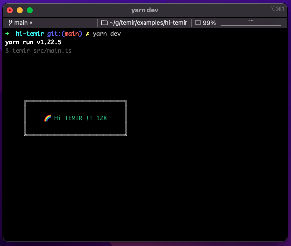
  - [borders](https://github.com/webfansplz/temir/tree/main/examples/borders)   
    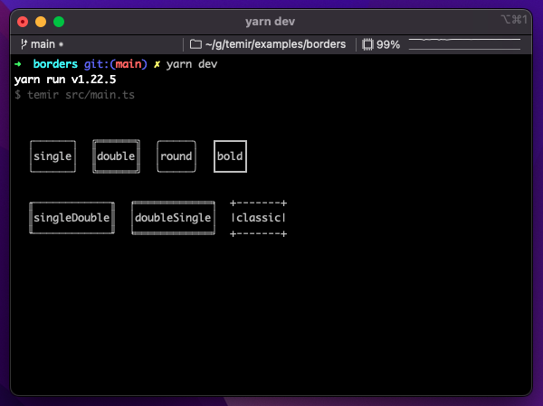
  - [table](https://github.com/webfansplz/temir/tree/main/examples/table)   
    
  - [temir-link](https://github.com/webfansplz/temir/tree/main/examples/temir-link)   
    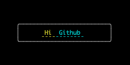
  - [temir-spinner](https://github.com/webfansplz/temir/tree/main/examples/temir-spinner)   
    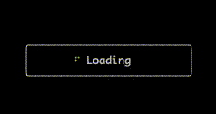
  - [temir-tab](https://github.com/webfansplz/temir/tree/main/examples/temir-tab)   
    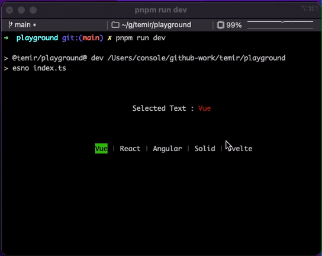
  - [temir-select-input](https://github.com/webfansplz/temir/tree/main/examples/temir-select-input)   
    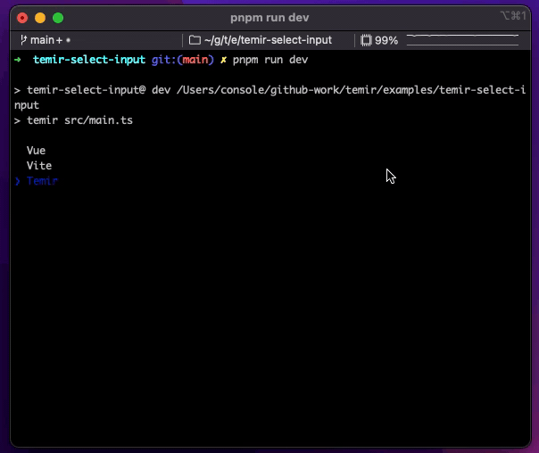
  - [Vitest](https://github.com/webfansplz/temir/tree/main/examples/vitest)  
    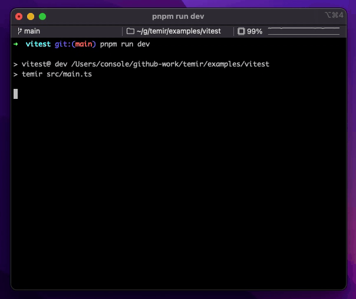

## Getting Started

Use `@temir/cli` to quickly scaffold a new Temir-based CLI.

```sh

mkdir my-temir-cli

cd my-temir-cli

touch main.ts

npm install @temir/cli

# Dev

temir main.ts

# Build

temir build main.ts
```

You can also check it out this [example](https://github.com/webfansplz/temir/tree/main/examples/hi-temir) to get started.Feel free to play around with the example and fork this repl at [repl.it sandbox](https://replit.com/@webfansplz/hi-temir?v=1)

Temir uses Yoga - a Flexbox layout engine to build great user interfaces for your CLIs using familiar CSS-like props you've used when building apps for the browser. It's important to remember that each element is a Flexbox container. Think of it as if each <div> in the browser had display: flex. See <Box> built-in component below for documentation on how to use Flexbox layouts in Ink. Note that all text must be wrapped in a <Text> component.

## Components

### `<Text>`

This component can display text, and change its style to make it bold, underline, italic or strikethrough.


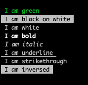

```vue
<TText color="green">
  I am green
</TText>

<TText color="black" background-color="white">
  I am black on white
</TText>

<TText color="white">
  I am white
</TText>

<TText :bold="true">
  I am bold
</TText>

<TText :italic="true">
  I am italic
</TText>

<TText :underline="true">
  I am underline
</TText>

<TText :strikethrough="true">
  I am strikethrough
</TText>

<TText :inverse="true">
  I am inversed
</TText>

```

**Note:** `<Text>` allows only text nodes and nested `<Text>` components inside of it. For example, `<Box>` component can't be used inside `<Text>`.

#### color

Type: `string`

Change text color.
Temir uses [chalk](https://github.com/chalk/chalk) under the hood, so all its functionality is supported.

```vue
<TBox flex-direction="column">
  <TText color="green">
    Green
  </TText>
  <TText color="blue">
    Blue
  </TText>
  <TText color="red">
    Red
  </TText>
</TBox>
```

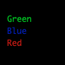

#### backgroundColor

Type: `string`

Same as `color` above, but for background.

```vue
<TBox flex-direction="column">
  <TText background-color="green">
    Green
  </TText>
  <TText background-color="blue">
    Blue
  </TText>
  <TText background-color="red">
    Red
  </TText>
</TBox>

```

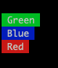

#### dimColor

Type: `boolean`\
Default: `false`

Dim the color (emit a small amount of light).

```vue
<Text color="red" dimColor>
	Dimmed Red
</Text>
```

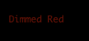

#### bold

Type: `boolean`\
Default: `false`

Make the text bold.

#### italic

Type: `boolean`\
Default: `false`

Make the text italic.

#### underline

Type: `boolean`\
Default: `false`

Make the text underlined.

#### strikethrough

Type: `boolean`\
Default: `false`

Make the text crossed with a line.

#### inverse

Type: `boolean`\
Default: `false`

Inverse background and foreground colors.

```vue
<TText color="yellow" :inverse="true">
  Inversed Yellow
</TText>
```

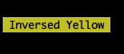

#### wrap

Type: `string`\
Allowed values: `wrap` `truncate` `truncate-start` `truncate-middle` `truncate-end`\
Default: `wrap`

This property tells Temir to wrap or truncate text if its width is larger than container.
If `wrap` is passed (by default), Temir will wrap text and split it into multiple lines.
If `truncate-*` is passed, Temir will truncate text instead, which will result in one line of text with the rest cut off.

```vue
<template>
  <TBox :width="7">
    <TText>Hello World</TText>
  </TBox>
  //=> 'Hello\nWorld'

  // `truncate` is an alias to `truncate-end`
  <TBox :width="7">
    <TText wrap="truncate">
      Hello World
    </TText>
  </TBox>
  //=> 'Hello…'

  <TBox :width="7">
    <TText wrap="truncate-middle">
      Hello World
    </TText>
  </TBox>
  //=> 'He…ld'

  <TBox :width="7">
    <TText wrap="truncate-start">
      Hello World
    </TText>
  </TBox>
  //=> '…World'
</template>
```

### `<Box>`

`<Box>` is an essential Temir component to build your layout.
It's like `<div style="display: flex">` in the browser.

```vue
<script>
import { TBox, TText } from '@temir/core'
</script>

<template>
  <TBox :margin="2">
    <TText>This is a box with margin</TText>
  </TBox>
</template>
```

#### Dimensions

##### width

Type: `number` `string`

Width of the element in spaces.
You can also set it in percent, which will calculate the width based on the width of parent element.

```vue
<template>
  <TBox :width="4">
    <TText>X</TText>
  </TBox>

  //=> 'X   '
</template>
```

```vue
<template>
  <TBox :width="10">
    <TBox width="50%">
      <TText>X</TText>
    </TBox>

    <TText>
      Y
    </TText>
  </TBox>

  //=> 'X    Y'
</template>
```

##### height

Type: `number` `string`

Height of the element in lines (rows).
You can also set it in percent, which will calculate the height based on the height of parent element.

```vue
<template>
  <TBox :height="4">
    <TText>X</TText>
  </TBox>
  //=> 'X\n\n\n'
</template>
```

```vue
<template>
  <TBox :height="6" flex-direction="column">
    <TBox height="50%">
      <TText>X</TText>
    </TBox>

    <TText>
      Y
    </TText>
  </TBox>
  //=> 'X\n\n\nY\n\n'
</template>
```

##### minWidth

Type: `number`

Sets a minimum width of the element.
Percentages aren't supported yet, see https://github.com/facebook/yoga/issues/872.

##### minHeight

Type: `number`

Sets a minimum height of the element.
Percentages aren't supported yet, see https://github.com/facebook/yoga/issues/872.

#### Padding

##### paddingTop

Type: `number`\
Default: `0`

Top padding.

##### paddingBottom

Type: `number`\
Default: `0`

Bottom padding.

##### paddingLeft

Type: `number`\
Default: `0`

Left padding.

##### paddingRight

Type: `number`\
Default: `0`

Right padding.

##### paddingX

Type: `number`\
Default: `0`

Horizontal padding. Equivalent to setting `paddingLeft` and `paddingRight`.

##### paddingY

Type: `number`\
Default: `0`

Vertical padding. Equivalent to setting `paddingTop` and `paddingBottom`.

##### padding

Type: `number`\
Default: `0`

Padding on all sides. Equivalent to setting `paddingTop`, `paddingBottom`, `paddingLeft` and `paddingRight`.

```vue
<template>
  <TBox :padding-top="2">
    <TText>Top</TText>
  </TBox>

  <TBox :padding-bottom="2">
    <TText>Bottom</TText>
  </TBox>

  <TBox :padding-left="2">
    <TText>Left</TText>
  </TBox>

  <TBox :padding-right="2">
    <TText>Right</TText>
  </TBox>

  <TBox :padding-x="2">
    <TText>Left and right</TText>
  </TBox>

  <TBox :padding-y="2">
    <TText>Top and bottom</TText>
  </TBox>

  <TBox :padding="2">
    <TText>Top, bottom, left and right</TText>
  </TBox>
</template>

```

#### Margin

##### marginTop

Type: `number`\
Default: `0`

Top margin.

##### marginBottom

Type: `number`\
Default: `0`

Bottom margin.

##### marginLeft

Type: `number`\
Default: `0`

Left margin.

##### marginRight

Type: `number`\
Default: `0`

Right margin.

##### marginX

Type: `number`\
Default: `0`

Horizontal margin. Equivalent to setting `marginLeft` and `marginRight`.

##### marginY

Type: `number`\
Default: `0`

Vertical margin. Equivalent to setting `marginTop` and `marginBottom`.

##### margin

Type: `number`\
Default: `0`

Margin on all sides. Equivalent to setting `marginTop`, `marginBottom`, `marginLeft` and `marginRight`.

```vue
<template>
  <TBox :margin-top="2">
    <TText>Top</TText>
  </TBox>

  <TBox :margin-bottom="2">
    <TText>Bottom</TText>
  </TBox>

  <TBox :margin-left="2">
    <TText>Left</TText>
  </TBox>

  <TBox :margin-right="2">
    <TText>Right</TText>
  </TBox>

  <TBox :margin-x="2">
    <TText>Left and right</TText>
  </TBox>

  <TBox :margin-y="2">
    <TText>Top and bottom</TText>
  </TBox>

  <TBox :margin="2">
    <TText>Top, bottom, left and right</TText>
  </TBox>
</template>
```

#### Flex

##### flexGrow

Type: `number`\
Default: `0`

See [flex-grow](https://css-tricks.com/almanac/properties/f/flex-grow/).

```vue
<template>
  <TBox>
    <TText>Label:</TText>
    <TBox :flex-grow="1">
      <TText>Fills all remaining space</TText>
    </TBox>
  </TBox>
</template>
```

##### flexShrink

Type: `number`\
Default: `1`

See [flex-shrink](https://css-tricks.com/almanac/properties/f/flex-shrink/).

```vue
<template>
  <TBox :width="20">
    <TBox :flex-shrink="2" :width="10">
      <TText>Will be 1/4</TText>
    </TBox>

    <TBox :width="10">
      <TText>Will be 3/4</TText>
    </TBox>
  </TBox>
</template>
```

##### flexBasis

Type: `number` `string`

See [flex-basis](https://css-tricks.com/almanac/properties/f/flex-basis/).

```vue
<template>
  <TBox :width="6">
    <TBox :flex-basis="3">
      <TText>X</TText>
    </TBox>

    <TText>
      Y
    </TText>
  </TBox>
  //=> 'X  Y'
</template>
```

```vue
<template>
  <TBox :width="6">
    <TBox flex-basis="50%">
      <TText>X</TText>
    </TBox>

    <TText>
      Y
    </TText>
  </TBox>
  //=> 'X  Y'
</template>
```

##### flexDirection

Type: `string`\
Allowed values: `row` `row-reverse` `column` `column-reverse`

See [flex-direction](https://css-tricks.com/almanac/properties/f/flex-direction/).

```vue
<template>
  <TBox>
    <TBox :margin-right="1">
      <TText>X</TText>
    </TBox>

    <TText>
      Y
    </TText>
  </TBox>
  // X Y

  <TBox flex-direction="row-reverse">
    <TText>X</TText>
    <TBox :margin-right="1">
      <TText>Y</TText>
    </TBox>
  </TBox>
  // Y X

  <TBox flex-direction="column">
    <TText>X</TText>
    <TText>Y</TText>
  </TBox>
  // X
  // Y

  <TBox flex-direction="column-reverse">
    <TText>X</TText>
    <TText>Y</TText>
  </TBox>
  // Y
  // X
</template>
```

##### alignItems

Type: `string`\
Allowed values: `flex-start` `center` `flex-end`

See [align-items](https://css-tricks.com/almanac/properties/a/align-items/).

```vue
<template>
  <TBox align-items="flex-start">
    <TBox :margin-right="1">
      <TText>X</TText>
    </TBox>

    <TText>
      A
      <TNewline />
      B
      <TNewline />
      C
    </TText>
  </TBox>
  // X A
  //   B
  //   C

  <TBox align-items="center">
    <TBox margin-right="1">
      <TText>X</TText>
    </TBox>

    <TText>
      A
      <TNewline />
      B
      <TNewline />
      C
    </TText>
  </TBox>
  //   A
  // X B
  //   C

  <TBox align-items="flex-end">
    <TBox margin-right="1">
      <TText>X</TText>
    </TBox>

    <TText>
      A
      <TNewline />
      B
      <TNewline />
      C
    </TText>
  </TBox>
  //   A
  //   B
  // X C
</template>
```

##### alignSelf

Type: `string`\
Default: `auto`\
Allowed values: `auto` `flex-start` `center` `flex-end`

See [align-self](https://css-tricks.com/almanac/properties/a/align-self/).

```vue
<template>
  <TBox :height="3">
    <TBox align-self="flex-start">
      <TText>X</TText>
    </TBox>
  </TBox>
  // X
  //
  //

  <TBox :height="3">
    <TBox align-self="center">
      <TText>X</TText>
    </TBox>
  </TBox>
  //
  // X
  //

  <TBox :height="3">
    <TBox align-self="flex-end">
      <TText>X</TText>
    </TBox>
  </TBox>
  //
  //
  // X
</template>
```

##### justifyContent

Type: `string`\
Allowed values: `flex-start` `center` `flex-end` `space-between` `space-around`

See [justify-content](https://css-tricks.com/almanac/properties/j/justify-content/).

```vue
<template>
  <TBox justify-content="flex-start">
    <TText>X</TText>
  </TBox>
  // [X      ]

  <TBox justify-content="center">
    <TText>X</TText>
  </TBox>
  // [   X   ]

  <TBox justify-content="flex-end">
    <TText>X</TText>
  </TBox>
  // [      X]

  <TBox justify-content="space-between">
    <TText>X</TText>
    <TText>Y</TText>
  </TBox>
  // [X      Y]

  <TBox justify-content="space-around">
    <TText>X</TText>
    <TText>Y</TText>
  </TBox>
  // [  X   Y  ]
</template>
```

#### Visibility

##### display

Type: `string`\
Allowed values: `flex` `none`\
Default: `flex`

Set this property to `none` to hide the element.

#### Borders

##### borderStyle

Type: `string`\
Allowed values: `single` `double` `round` `bold` `singleDouble` `doubleSingle` `classic`

Add a border with a specified style.
If `borderStyle` is `undefined` (which it is by default), no border will be added.
Temir uses border styles from [`cli-boxes`](https://github.com/sindresorhus/cli-boxes) module.

```vue
<template>
  <TBox flex-direction="column">
    <TBox>
      <TBox border-style="single" :margin-right="2">
        <TText>single</TText>
      </TBox>

      <TBox border-style="double" :margin-right="2">
        <TText>double</TText>
      </TBox>

      <TBox border-style="round" :margin-right="2">
        <TText>round</TText>
      </TBox>

      <TBox border-style="bold">
        <TText>bold</TText>
      </TBox>
    </TBox>

    <TBox :margin-top="1">
      <TBox border-style="singleDouble" :margin-right="2">
        <TText>singleDouble</TText>
      </TBox>

      <TBox border-style="doubleSingle" :margin-right="2">
        <TText>doubleSingle</TText>
      </TBox>

      <TBox border-style="classic">
        <TText>classic</TText>
      </TBox>
    </TBox>
  </TBox>
</template>
```


##### borderColor

Type: `string`

Change border color.
Accepts the same values as [`color`](#color) in `<Text>` component.

```vue
<template>
  <TBox border-style="round" border-color="green">
    <TText>Green Rounded Box</TText>
  </TBox>
</template>
```

### `<Newline>`

Adds one or more newline (`\n`) characters.
Must be used within `<Text>` components.

#### count

Type: `number`\
Default: `1`

Number of newlines to insert.

```vue
<script>
import { TBox, TNewline, TText } from '@temir/core'
</script>

<template>
  <TBox>
    <TText>
      <TText color="green">
        Hello
      </TText>
      <TNewline />
      <TText color="red">
        World
      </TText>
    </TText>
  </TBox>
</template>

```

Output:

```
Hello
World
```

### `<Spacer>`

A flexible space that expands along the major axis of its containing layout.
It's useful as a shortcut for filling all the available spaces between elements.

For example, using `<Spacer>` in a `<Box>` with default flex direction (`row`) will position "Left" on the left side and will push "Right" to the right side.

```vue
<script lang="ts" setup>
import { TBox, TSpacer, TText } from '@temir/core'
</script>

<template>
  <TBox>
    <TText>Left</TText>
    <TSpacer />
    <TText>Right</TText>
  </TBox>
</template>

```

In a vertical flex direction (`column`), it will position "Top" to the top of the container and push "Bottom" to the bottom of it.
Note, that container needs to be tall to enough to see this in effect.

```vue
<script lang="ts" setup>
import { TBox, TSpacer, TText } from '@temir/core'
</script>

<template>
  <TBox flex-direction="column" :height="10">
    <TText>Top</TText>
    <TSpacer />
    <TText>Bottom</TText>
  </TBox>
</template>

```

## Credits

This project is highly inspired by [ink](https://github.com/vadimdemedes/ink)

[vite-node](https://github.com/antfu/vite-node) made the HMR support easily
